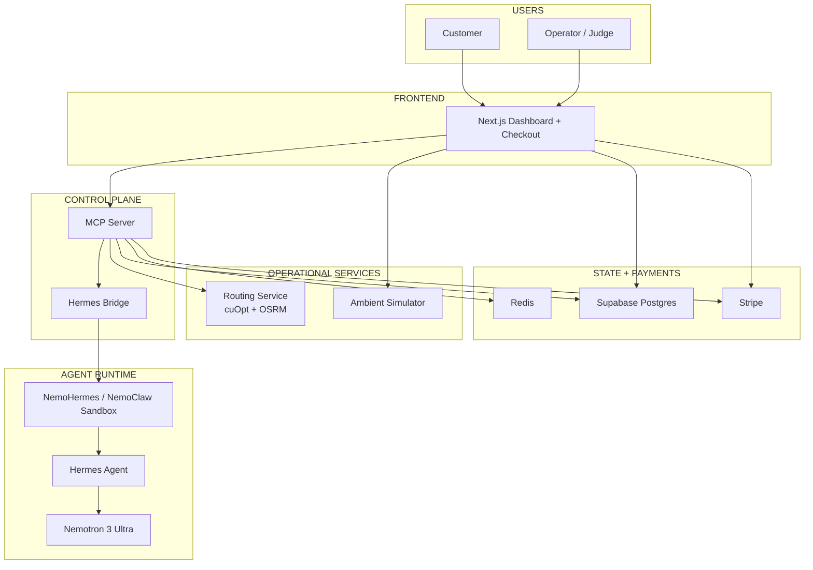

# HermesRoutiq Architecture

HermesRoutiq is a prototype autonomous delivery operations stack built around a live breakdown-recovery workflow.
The system combines a customer-facing checkout flow, an operator-facing dispatch UI, a Hermes agent runtime, routing services, and payment infrastructure.

## System overview



## Core components

### 1. Web application

`apps/web`

The Next.js app is the main surface for both checkout and operations visibility.
It renders:

- the live 2.5D city map
- active routes and incidents
- Hermes reasoning output
- payment and recovery panels

It also hosts the app-side API routes that coordinate dashboard data, Stripe checkout, and simulation state hydration.

### 2. MCP server

`services/mcp-server`

This is the typed operations layer Hermes uses.
It exposes structured tools for:

- incident inspection
- route optimization requests
- payout and refund workflows
- policy checks
- audit logging
- business state access

This service is where business rules are enforced before actions are executed.

### 3. Hermes bridge

`services/hermes-bridge`

The bridge connects the repo to the local Hermes runtime running inside the NVIDIA sandbox setup.
It lets the app-side services call the Hermes runtime without putting model orchestration logic directly in the frontend.

### 4. Routing service

`services/routing`

The routing service is a separate FastAPI service that combines:

- **NVIDIA cuOpt** for assignment and recovery optimization
- **OSRM** for road-following geometry

This separation keeps optimization and map geometry out of the UI code and makes the incident workflow easier to reason about and debug.

### 5. Ambient simulator

`services/simulator`

The ambient simulator supplies:

- traffic zones
- ambient moving vehicles
- signal lights
- scenario timing

It makes the city feel alive while the business workflow plays out on top of it.

### 6. State and payments

- **Supabase Postgres** stores orders, incidents, vehicles, decisions, ledger entries, policy evaluations, and recovery outcomes.
- **Redis** stores hot simulation state and synchronization markers.
- **Stripe** powers checkout, webhook confirmation, Connect payouts, and project provisioning flows.

## Main operational flow

### Delivery creation

1. A customer request enters through the web app
2. Stripe Checkout confirms payment
3. The order becomes dispatchable
4. Routing is requested
5. The assigned vehicle and route appear in the dashboard

### Vehicle breakdown recovery

1. A live delivery vehicle breaks down
2. The incident is recorded and surfaced on the map
3. Hermes receives the incident context through the bridge and MCP layer
4. Hermes evaluates financial exposure, available drivers, and recovery options
5. Routing tools compute the best recovery path
6. Policy checks and payment actions are enforced before execution
7. The updated route and recovery outcome are rendered back in the UI

## Why the architecture is split this way

### Separate routing service

Routing is isolated because optimization logic, network dependencies, and geometry processing are operational concerns, not UI concerns.

### Separate Hermes bridge

The Hermes runtime has its own sandbox and model/provider lifecycle.
Keeping the bridge separate makes the integration easier to observe and safer to evolve.

### Separate simulator

The ambient simulator changes at a different cadence than order dispatch logic.
Separating it prevents city-simulation concerns from leaking into checkout, MCP tools, or payment workflows.

## Trust and control boundaries

HermesRoutiq is designed so that the agent does not directly own the entire system surface.

- Hermes reasons through tools rather than direct database access
- operational actions flow through the MCP server
- policy and spend checks are enforced at the application layer
- payment infrastructure remains on the controlled service side
- state is persisted outside the frontend so the dashboard can recover after reloads

## Repo map

```text
HermesRoutiq/
|-- apps/web/               # UI, checkout, dashboard API routes
|-- packages/shared/        # Shared types
|-- services/mcp-server/    # Tool server + reasoning orchestration
|-- services/hermes-bridge/ # Hermes runtime bridge
|-- services/routing/       # FastAPI routing service
|-- services/simulator/     # Ambient city simulator
|-- supabase/               # Migrations and seed data
|-- docs/                   # Setup, demo, security docs
`-- ops/nemoclaw/           # Sandbox helper scripts
```

## Related docs

- [README](README.md)
- [Implementation plan](IMPLEMENTATION_PLAN.md)
- [NemoClaw setup](docs/NEMOCLAW_SETUP.md)
- [Security policy](docs/SECURITY_POLICY.md)
