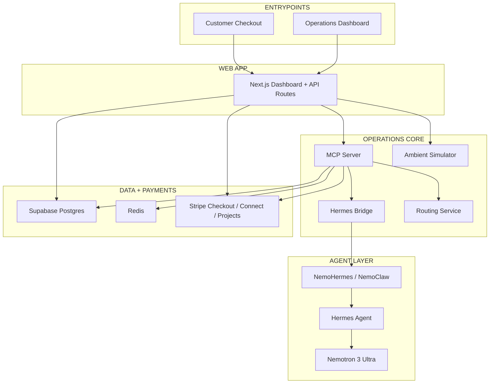

# HermesRoutiq - Autonomous Delivery Operations Company

[](https://nextjs.org/)
[](https://www.typescriptlang.org/)
[](https://fastapi.tiangolo.com/)
[](https://github.com/NousResearch/hermes-agent)
[](https://stripe.com/)
[](https://build.nvidia.com/nvidia/cuopt)

HermesRoutiq is a prototype **autonomous delivery company** for last-mile operations.
It shows how a Hermes agent can monitor a live fleet, react to a vehicle failure, evaluate financial risk, call routing and payment tools, and drive recovery in real time.

Built for the **Hermes Agent Accelerated Business Hackathon** by Nous Research, NVIDIA, and Stripe.

## Demo

**Watch the full walkthrough: [youtu.be/QxU-MQ4tS48](https://youtu.be/QxU-MQ4tS48)**

The agent recovers a live vehicle breakdown end to end — reading state, comparing options, paying a replacement driver through Stripe Connect, and banking the recovery as a reusable skill.

| Recovery complete | Real Stripe Connect payout |
|---|---|
|  |  |


## The problem

Last-mile delivery breaks down fast when a driver or vehicle fails mid-route:

- an active order is suddenly at risk
- customer refunds and churn become likely
- dispatch teams need a replacement decision immediately
- rerouting, payouts, and audit trails have to happen under pressure

HermesRoutiq turns that failure into an autonomous operations workflow.

## What HermesRoutiq does

- Runs a live delivery control room on a 2.5D city map
- Tracks active deliveries, incidents, policy checks, and payments
- Lets Hermes reason through breakdown recovery in real time
- Uses routing services to assign or reroute delivery work
- Uses Stripe to handle checkout and driver payout flows
- Persists operational state, decisions, and financial records for auditability

## Demo focus

The strongest demo path in this repo is the **vehicle breakdown scenario**:

1. A customer delivery is created and released onto the map
2. A vehicle breaks down while carrying active work
3. Hermes detects the incident context and reviews available options
4. Routing and policy tools are called to recover the operation
5. The UI shows the live recovery path, reasoning feed, and outcome

## Tech stack

| Layer | Technologies |
|---|---|
| **Agent** | Hermes Agent, NemoHermes / NemoClaw sandbox, Nemotron 3 Ultra |
| **Frontend** | Next.js 14, React 18, Tailwind CSS, MapLibre GL, deck.gl |
| **Operations Core** | TypeScript, Node.js, Zod, MCP server |
| **Routing** | FastAPI, NVIDIA cuOpt, OSRM |
| **Simulation** | Python ambient traffic simulator, seeded delivery world |
| **Data** | Supabase Postgres, Redis |
| **Payments** | Stripe Checkout, Stripe webhooks, Stripe Connect, Stripe Projects |

## Architecture



## How it works

### 1. Delivery intake

The web app creates a customer payment flow through Stripe Checkout.
Once payment is confirmed, the order becomes operationally eligible for dispatch.

### 2. Dispatch and routing

The operations layer persists the order, selects an available vehicle, and requests route optimization through the routing service.
cuOpt handles assignment logic and OSRM supplies road-following geometry for the map.

### 3. Live simulation

The map shows active vehicles, route overlays, traffic zones, and signal context while the ambient simulator keeps the city visually alive.

### 4. Incident response

When a vehicle breakdown is triggered, Hermes receives the incident context, reviews affected deliveries, checks available recovery options, and requests the tools it needs.

### 5. Recovery execution

The system can reassign work, replan routes, run policy checks, record decisions, and process payout-related operations while keeping the operator UI in sync.

## Why this matters

HermesRoutiq is not just a route viewer.
It is a prototype for an autonomous company where an agent helps run dispatch, recovery, and business operations together:

- **routing intelligence** for assignment and recovery
- **financial awareness** around payouts, refunds, and margin
- **policy enforcement** before risky actions execute
- **live visibility** for operators and judges watching the system work

## Project structure

```text
HermesRoutiq/
|-- apps/web/               # Next.js dashboard, API routes, checkout UI
|-- packages/shared/        # Shared types across frontend and services
|-- services/mcp-server/    # Hermes tool server and reasoning orchestration
|-- services/routing/       # FastAPI routing service for cuOpt + OSRM
|-- services/simulator/     # Ambient traffic and signal simulation
|-- services/hermes-bridge/ # Bridge into local Hermes runtime
|-- supabase/               # Migrations and seed data
|-- docs/                   # Architecture, security, setup, demo notes
`-- ops/nemoclaw/           # NemoClaw / sandbox helper scripts
```

## Quick start

### Prerequisites

- Node.js 20+
- Python 3.10+
- Supabase project
- Redis
- Stripe test keys
- Hermes runtime / NemoHermes setup for full agent flow

### Local development

1. Clone the repo
2. Install workspace dependencies
3. Copy environment files and configure keys
4. Run database setup
5. Start the routing service
6. Start the simulator
7. Start the MCP server
8. Start the web app

Useful commands:

```bash
npm install
npm run db:setup
npm run mcp:dev
npm run dev
```

Routing service:

```bash
cd services/routing
python -m uvicorn app.main:app --reload --port 8001
```

Ambient simulator:

```bash
cd services/simulator
python -m uvicorn app.main:app --reload --port 8010
```

For the full Hermes sandbox path, see [docs/NEMOCLAW_SETUP.md](docs/NEMOCLAW_SETUP.md).

## Documentation

- [Architecture](ARCHITECTURE.md)
- [Implementation plan](IMPLEMENTATION_PLAN.md)
- [Security policy](docs/SECURITY_POLICY.md)
- [NemoClaw setup](docs/NEMOCLAW_SETUP.md)
- [Demo script](docs/DEMO_SCRIPT.md)

## Hackathon framing

HermesRoutiq explores a simple question:

**Can Hermes run part of a delivery company end to end when operations go wrong?**

This repo answers that question through a live breakdown-and-recovery demo that combines:

- agent reasoning
- routing tools
- policy constraints
- payments infrastructure
- operational visibility

## Credits

- **Nous Research** - Hermes Agent
- **NVIDIA** - Nemotron 3 Ultra, cuOpt, NemoClaw / NemoHermes context
- **Stripe** - Checkout, Connect, Projects
- **Snehal707** - HermesRoutiq
