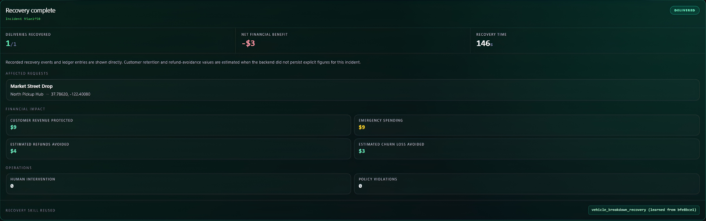
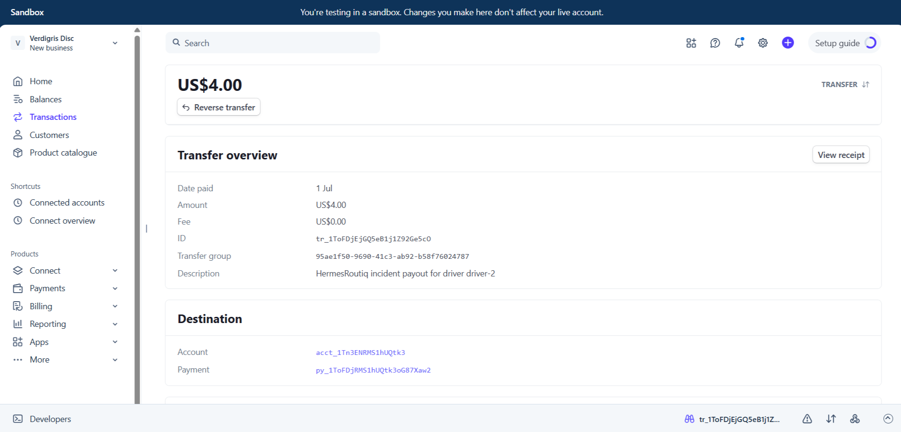
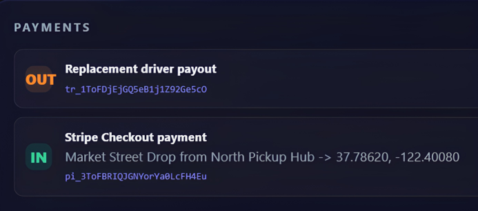
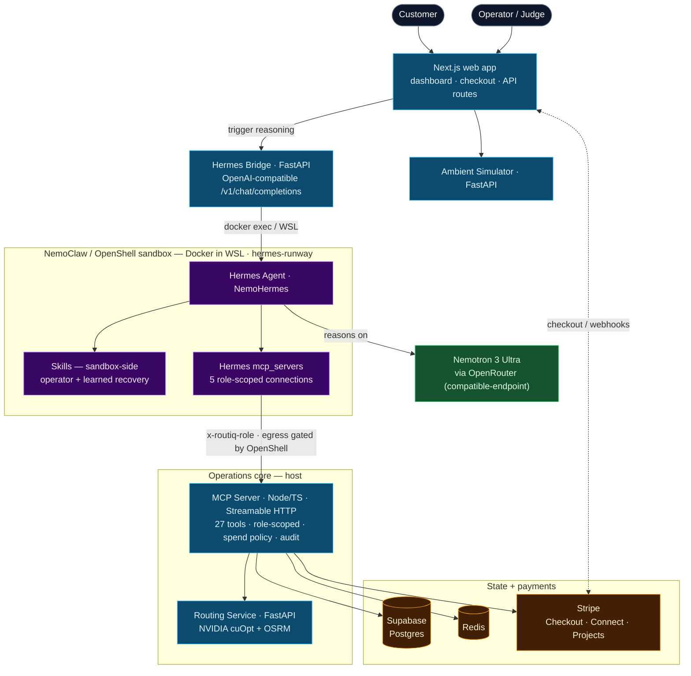

# HermesRoutiq - Autonomous Delivery Operations Company

[](https://nextjs.org/)
[](https://www.typescriptlang.org/)
[](https://fastapi.tiangolo.com/)
[](https://github.com/NousResearch/hermes-agent)
[](https://stripe.com/)
[](https://build.nvidia.com/nvidia/cuopt)

HermesRoutiq is a prototype **autonomous delivery company** for last-mile operations.
It shows how a Hermes agent can monitor a live fleet, react to a vehicle failure, evaluate financial risk, call routing and payment tools, and drive recovery in real time.

Built for the **Hermes Agent Accelerated Business Hackathon** by Nous Research, NVIDIA, and Stripe.

## Demo

[](https://youtu.be/QxU-MQ4tS48)

**Watch the full walkthrough: [youtu.be/QxU-MQ4tS48](https://youtu.be/QxU-MQ4tS48)**

The agent recovers a live vehicle breakdown end to end — reading state, comparing options, paying a replacement driver through Stripe Connect, and banking the recovery as a reusable skill.

| Recovery complete | Real Stripe Connect payout |
|---|---|
|  |  |



## The problem

Last-mile delivery breaks down fast when a driver or vehicle fails mid-route:

- an active order is suddenly at risk
- customer refunds and churn become likely
- dispatch teams need a replacement decision immediately
- rerouting, payouts, and audit trails have to happen under pressure

HermesRoutiq turns that failure into an autonomous operations workflow.

## What HermesRoutiq does

- Runs a live delivery control room on a 2.5D city map
- Tracks active deliveries, incidents, policy checks, and payments
- Lets Hermes reason through breakdown recovery in real time
- Uses routing services to assign or reroute delivery work
- Uses Stripe to handle checkout and driver payout flows
- Persists operational state, decisions, and financial records for auditability

## Demo focus

The strongest demo path in this repo is the **vehicle breakdown scenario**:

1. A customer delivery is created and released onto the map
2. A vehicle breaks down while carrying active work
3. Hermes detects the incident context and reviews available options
4. Routing and policy tools are called to recover the operation
5. The UI shows the live recovery path, reasoning feed, and outcome

## Tech stack

| Layer | Technologies |
|---|---|
| **Agent** | Hermes Agent, NemoHermes / NemoClaw sandbox, Nemotron 3 Ultra |
| **Frontend** | Next.js 14, React 18, Tailwind CSS, MapLibre GL, deck.gl |
| **Operations Core** | TypeScript, Node.js, Zod, MCP server |
| **Routing** | FastAPI, NVIDIA cuOpt, OSRM |
| **Simulation** | Python ambient traffic simulator, seeded delivery world |
| **Data** | Supabase Postgres, Redis |
| **Payments** | Stripe Checkout, Stripe webhooks, Stripe Connect, Stripe Projects |

## Architecture



## How it works

### 1. Delivery intake

The web app creates a customer payment flow through Stripe Checkout.
Once payment is confirmed, the order becomes operationally eligible for dispatch.

### 2. Dispatch and routing

The operations layer persists the order, selects an available vehicle, and requests route optimization through the routing service.
cuOpt handles assignment logic and OSRM supplies road-following geometry for the map.

### 3. Live simulation

The map shows active vehicles, route overlays, traffic zones, and signal context while the ambient simulator keeps the city visually alive.

### 4. Incident response

When a vehicle breakdown is triggered, Hermes receives the incident context, reviews affected deliveries, checks available recovery options, and requests the tools it needs.

### 5. Recovery execution

The system can reassign work, replan routes, run policy checks, record decisions, and process payout-related operations while keeping the operator UI in sync.

## NVIDIA cuOpt — the routing brain

Every "who drives what, in what order" decision — normal dispatch **and** breakdown/congestion recovery — is solved by **[NVIDIA cuOpt](https://build.nvidia.com/nvidia/cuopt)**, NVIDIA's GPU-accelerated route-optimization engine. This is a real vehicle-routing solve against NVIDIA's managed cuOpt endpoint, not a nearest-neighbour heuristic or a mock.

- **Where it lives:** `services/routing/app/providers/cuopt_provider.py`, behind a `RoutingProvider` interface. `cuopt-osrm` is the default provider (`ROUTING_PROVIDER`).
- **Real VRP model:** cuOpt receives a full vehicle-routing problem — fleet capacities, per-vehicle time windows and max drive times, and per-task demand, service time, and delivery windows.
- **Real road costs:** OSRM builds the distance + travel-time cost matrix over the actual street network (`services/routing/app/cost_matrix.py`), so cuOpt optimizes on real drive times, not straight lines.
- **Managed NVCF flow:** requests go to `optimize.api.nvidia.com/v1/nvidia/cuopt` with async submit → status poll → result download.
- **Rich solution:** cuOpt returns optimal vehicle→task assignments, stop sequencing, and arrival stamps, which become routes, ETAs, unassigned/dropped tasks, and deadline violations.

The exact vehicle-routing problem sent to cuOpt (`services/routing/app/providers/cuopt_provider.py`):

```python
    def _build_cuopt_payload(
        self,
        drivers: list[DriverInput],
        orders: list[OrderInput],
        index_by_key: dict[str, int],
        duration_matrix: list[list[float]],
        distance_matrix: list[list[float]],
    ) -> dict[str, Any]:
        return {
            "cost_matrix_data": {"data": {"0": distance_matrix}},
            "travel_time_matrix_data": {"data": {"0": duration_matrix}},
            "fleet_data": {
                "vehicle_ids": [driver.id for driver in drivers],
                "vehicle_locations": [
                    [
                        index_by_key[f"driver-start:{driver.id}"],
                        index_by_key[f"driver-end:{driver.id}"],
                    ]
                    for driver in drivers
                ],
                "capacities": [
                    [max(driver.capacity - driver.current_load, 0) for driver in drivers]
                ],
                "vehicle_time_windows": [
                    [driver.time_window.start, driver.time_window.end] for driver in drivers
                ],
                "vehicle_max_times": [
                    driver.max_travel_time_seconds
                    if driver.max_travel_time_seconds is not None
                    else driver.time_window.end - driver.time_window.start
                    for driver in drivers
                ],
                "vehicle_types": [0 for _ in drivers],
                "drop_return_trips": [False for _ in drivers],
            },
            "task_data": {
                "task_ids": [order.id for order in orders],
                "task_locations": [index_by_key[f"order:{order.id}"] for order in orders],
                "demand": [[order.demand for order in orders]],
                "service_times": [order.service_time_seconds for order in orders],
                "task_time_windows": [
                    [
                        order.time_window.start if order.time_window else 0,
                        order.time_window.end if order.time_window else 86_400,
                    ]
                    for order in orders
                ],
            },
        }
```

**In the demo:** when a truck breaks down, Hermes calls cuOpt through the MCP `request_route_optimisation` and recovery tools to re-solve the VRP for the surviving fleet — reassigning the stranded stops and resequencing deliveries so the replacement route is optimal, not just "next closest." Config lives in `services/routing/.env.example` (`CUOPT_API_URL`, `CUOPT_STATUS_API_URL`, `CUOPT_API_KEY`). Full deep dive: **[docs/CUOPT.md](docs/CUOPT.md)**.

## Why this matters

HermesRoutiq is not just a route viewer.
It is a prototype for an autonomous company where an agent helps run dispatch, recovery, and business operations together:

- **routing intelligence** powered by NVIDIA cuOpt for assignment and recovery
- **financial awareness** around payouts, refunds, and margin
- **policy enforcement** before risky actions execute
- **live visibility** for operators and judges watching the system work

## Project structure

```text
HermesRoutiq/
|-- apps/web/               # Next.js dashboard, API routes, checkout UI
|-- packages/shared/        # Shared types across frontend and services
|-- services/mcp-server/    # Hermes tool server and reasoning orchestration
|-- services/routing/       # FastAPI routing service for cuOpt + OSRM
|-- services/simulator/     # Ambient traffic and signal simulation
|-- services/hermes-bridge/ # Bridge into local Hermes runtime
|-- supabase/               # Migrations and seed data
|-- docs/                   # Architecture, security, setup, demo notes
`-- ops/nemoclaw/           # NemoClaw / sandbox helper scripts
```

## Quick start

### Prerequisites

- Node.js 20+
- Python 3.10+
- Supabase project
- Redis
- Stripe test keys
- Hermes runtime / NemoHermes setup for full agent flow

### Local development

1. Clone the repo
2. Install workspace dependencies
3. Copy environment files and configure keys
4. Run database setup
5. Start the routing service
6. Start the simulator
7. Start the MCP server
8. Start the web app

Useful commands:

```bash
npm install
npm run db:setup
npm run mcp:dev
npm run dev
```

Routing service:

```bash
cd services/routing
python -m uvicorn app.main:app --reload --port 8001
```

Ambient simulator:

```bash
cd services/simulator
python -m uvicorn app.main:app --reload --port 8010
```

For the full Hermes sandbox path, see [docs/NEMOCLAW_SETUP.md](docs/NEMOCLAW_SETUP.md).

## Documentation

- [Architecture](ARCHITECTURE.md)
- [NVIDIA cuOpt routing](docs/CUOPT.md)
- [Implementation plan](IMPLEMENTATION_PLAN.md)
- [Security policy](docs/SECURITY_POLICY.md)
- [NemoClaw setup](docs/NEMOCLAW_SETUP.md)

## Hackathon framing

HermesRoutiq explores a simple question:

**Can Hermes run part of a delivery company end to end when operations go wrong?**

This repo answers that question through a live breakdown-and-recovery demo that combines:

- agent reasoning
- routing tools
- policy constraints
- payments infrastructure
- operational visibility

## Credits

- **Nous Research** - Hermes Agent
- **NVIDIA** - Nemotron 3 Ultra, cuOpt, NemoClaw / NemoHermes context
- **Stripe** - Checkout, Connect, Projects
- **Snehal707** - HermesRoutiq

## License

Released under the [MIT License](LICENSE).
